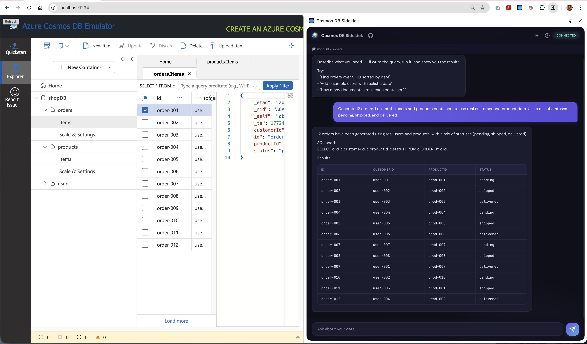
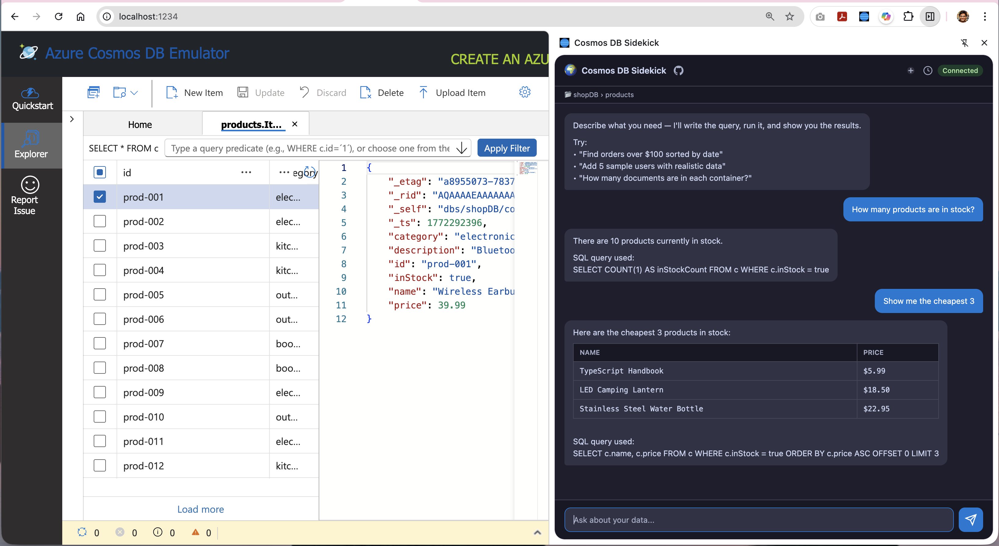
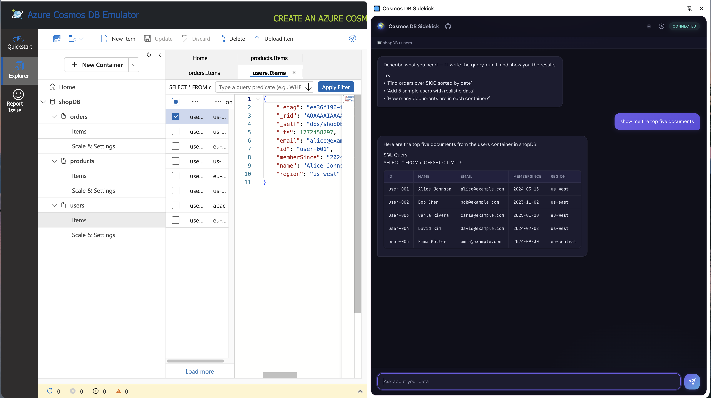
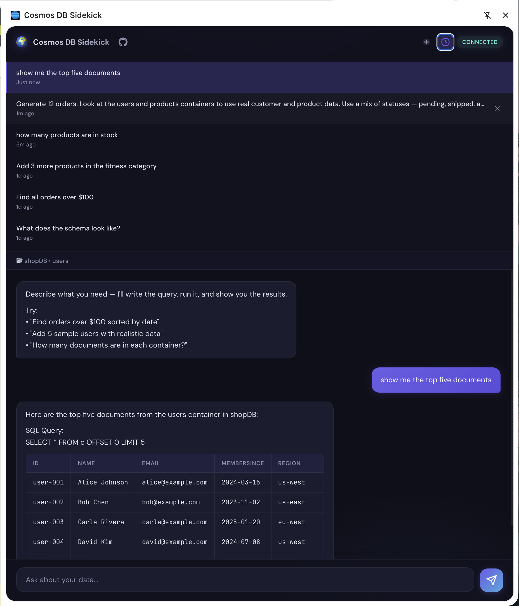

# Cosmos DB Sidekick 😎

Cosmos DB Sidekick is a chrome extension that works with a locally running [Azure Cosmos DB vNext emulator](https://learn.microsoft.com/en-us/azure/cosmos-db/emulator-linux) and allows you to explore data using natural language queries, powered by the [GitHub Copilot SDK](https://github.com/github/copilot-sdk).

Ask questions in plain English — the AI writes and runs actual queries against your emulator, shows results, and can even insert data.

## What you can do

> Click to play the quick demo, and scroll down for a detailed walkthrough of features and setup instructions.

<a href="https://abhirockzz.github.io/videos/cosmosdb_sidekick.mp4" target="_blank">
  
</a>

### Explore your data

- **"What does the schema look like?"** → samples documents and describes the structure
- **"Find all orders over $100"** → generates a SQL query, runs it, shows results with RU cost
- **"Which customers haven't placed an order in the last 90 days?"** → figures out the schema, writes the query, shows results



### Write data

- **"Add 10 test users to the users container"** → generates realistic test documents and inserts them
- **"Insert a document with name 'Alice' and age 30"** → creates and upserts a single document

> Uses upsert semantics: if a document with the same `id` exists, it gets replaced


### Context-aware Data Explorer integration

When the Cosmos DB emulator's Data Explorer is open in a browser tab, the extension **automatically detects** what you're looking at:

- The **context bar** below the header shows the active database and container (e.g. `📂 ordersDb › customers`)
- Context updates live as you switch between tabs in the Data Explorer
- Questions like **"show me the top 10 documents"** automatically target the container you're viewing
- If you mention a different database or container explicitly, it overrides the auto-detected context
- The side panel auto-opens when you visit the Data Explorer page



### Manage conversations

- Click **+** in the header to start a fresh conversation at any time
- Click the **clock icon** to open Chat History — a list of your past conversations
- Click any past conversation to switch to it and continue where you left off
- Hover a conversation and click **×** to remove it from history
- Your conversation is remembered even if you close and reopen the side panel



### Streaming responses

- Answers stream in real-time
- Results are formatted as tables, code blocks, or plain text depending on the response
- You can ask follow-up questions — the AI remembers the context of your conversation

## Prerequisites

1. **Google Chrome**
2. [**Node.js 22+**](https://nodejs.org/) (system-installed, required by the Copilot CLI)
3. **GitHub Copilot CLI** — [install it and login](https://docs.github.com/en/copilot/how-tos/set-up/install-copilot-cli)
4. **[Cosmos DB vNext Emulator](https://learn.microsoft.com/en-us/azure/cosmos-db/emulator)** running locally: `docker run --publish 8081:8081 --publish 1234:1234 mcr.microsoft.com/cosmosdb/linux/azure-cosmos-emulator:vnext-preview`

## Install

### 1. Clone the repository

```bash
git clone https://github.com/abhirockzz/cosmosdb-sidekick.git
cd cosmosdb-sidekick
```

### 2. Build the sidecar (one time)

```bash
cd sidecar && npm install
```

This installs dependencies and compiles TypeScript automatically.

### 3. Load the extension in Chrome

1. Open `chrome://extensions`
2. Enable **Developer mode** (top-right toggle)
3. Click **Load unpacked** → select the `extension/` folder

### 4. Start the sidecar

```bash
cd sidecar && npm start
```

Keep this running in a terminal while you use the extension. The sidecar runs until you stop it with `Ctrl+C`

> **Tip:** If you open the extension while the sidecar isn't running, it will show a startup screen with the command to run and a copy button. It auto-connects as soon as the sidecar starts.

## Usage

1. Start the Cosmos DB emulator and the sidecar (see above)
2. Click the **Cosmos DB Sidekick** icon in the Chrome toolbar — the side panel opens
3. Ask questions about your data in the chat box

Open the emulator's Data Explorer page — the side panel will auto-open and the context bar will show which database/container you're viewing. Your questions will automatically target that data.

> **Tip:** The side panel keeps its conversation when you switch between Chrome tabs. You can go back to any tab and pick up right where you left off.

## Configuration

| Environment Variable       | Default                 | Description                                                                                                                                                                                                                                        |
| -------------------------- | ----------------------- | -------------------------------------------------------------------------------------------------------------------------------------------------------------------------------------------------------------------------------------------------- |
| `COSMOS_EMULATOR_ENDPOINT` | `http://localhost:8081` | Emulator endpoint URL                                                                                                                                                                                                                              |
| `COPILOT_MODEL`            | `gpt-4.1`               | AI model used for Copilot chat sessions. Must be a model available in your [Copilot plan](https://docs.github.com/en/copilot/using-github-copilot/ai-models/supported-ai-models-in-copilot). Validated at session creation against `listModels()`. |

Example — start the sidecar with a different model:

```bash
COPILOT_MODEL=claude-sonnet-4.5 npm start
```

## Security

- **Emulator-only** — works only with vNext emulator locally with the well-known emulator key
- **Localhost-bound** — backend binds to `127.0.0.1:3001`, no network exposure
- **CORS-locked** — only accepts requests from the registered Chrome extension origin

## Troubleshooting

| Symptom                                        | Fix                                                                                                                                                                       |
| ---------------------------------------------- | ------------------------------------------------------------------------------------------------------------------------------------------------------------------------- |
| "Start the Sidecar" screen on open             | The sidecar isn't running. Run `cd sidecar && npm start` — the panel auto-connects when it's up. There's also a copy button to grab the command.                          |
| "Sidecar disconnected" banner mid-conversation | The sidecar process stopped. Restart it, then click **Retry** in the banner.                                                                                              |
| "⚠️ Cosmos DB emulator is not reachable" banner | The emulator isn't running or is still starting up. Start the Docker container (see Prerequisites), then click **Retry** — or wait, as the extension polls automatically. |
| Context bar not updating                       | Refresh the Data Explorer tab after reloading the extension.                                                                                                              |

⚠️ Disclaimer: This is an experimental project and not an official Microsoft or Azure offering. It’s designed for learning and sharing, not for production use. AI generated responses may be inaccurate or incomplete. Always review generated queries before running them against your data.